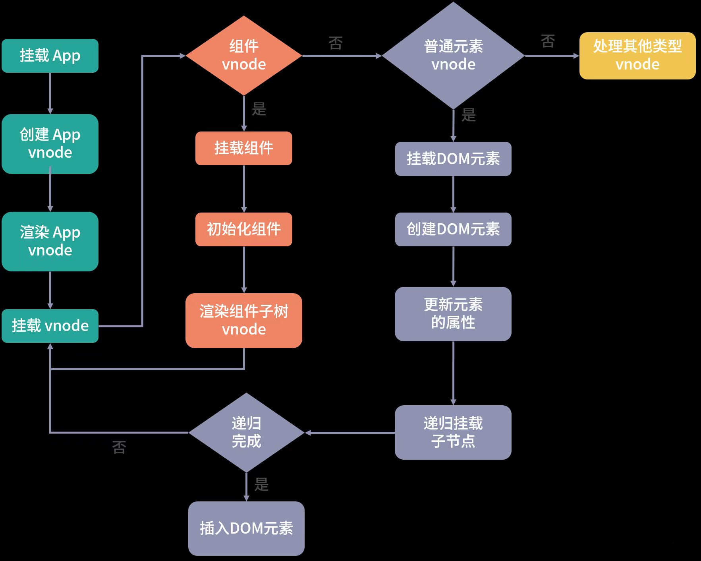

# Vue Runtime

首先要了解几个概念

1. runtime-dom vue的浏览器渲染器模块，针对浏览器运行时的一些dom操作api，属性，事件处理等
1. runtime-core vue的渲染器驱动模块，核心模块，不关心运行时的平台，可以理解成是抽象层

## 组件渲染：vnode 到真实 DOM 是如何转变的

在vue3中，可以说是万物皆组件，整个应用的页面都是通过组件渲染来实现的，譬如一个`heloo-world`组件，在页面中使用他

```html

<hello-world></hello-world>
```

组件是一个抽象的概念，是对一棵DOM树的抽象，就比如说上面这个组件，最终渲染成什么样子，他并不会在页面上直接渲染一个`hello-world`标签，而是取决于我们引入了怎么样的一个HelloWorld组件模板，比如说我们的组件模板是这样的

```html

<template>
  <div>
    <p>Hello World</p>
  </div>
</template>
```

那这个组件最终会通过这些编写的元素通过ast解析生成vnode，然后再去渲染vnode，最终才是真是的dom

### 页面初始化

Vue3常见的入口文件通常是这样的

```javascript
import { createApp } from 'vue'
import App from './app'

const app = createApp(App)
app.mount('#app')
```

可以看到，通过`createApp`入口函数创建了一个`vue`实例，然后实例上含有`mount`方法

代码如下:

```typescript
// 代码位置: src/runtime-dom/src/index.ts
const createApp = ((...args) => {

  // 创建 app 对象
  const app = ensureHydrationRenderer().createApp(...args)

  const { mount } = app

  // 重写 mount 方法
  app.mount = (containerOrSelector) => {
    // ...
  }

  return app
})

```

从代码中可以看出 `createApp` 主要做了两件事情：创建 `app 对象`和重写 `app.mount` 方法

### 1.创建app 对象

首先会使用`ensureRenderer().createApp()`创建app对象

```typescript
const app = ensureRenderer().createApp(...args)
```

其中 `ensureRenderer()` 用来创建一个渲染器对象，它的内部代码是这样的：

```javascript
// 渲染相关的一些配置，比如更新属性的方法，操作 DOM 的方法
const rendererOptions = {
  patchProp,
  ...nodeOps
}

let renderer

// 延时创建渲染器，当用户只依赖响应式包的时候，可以通过 tree-shaking 移除核心渲染逻辑相关的代码
function ensureRenderer() {
  return renderer || (renderer = createRenderer(rendererOptions))
}

function createRenderer(options) {
  return baseCreateRenderer(options)
}

function baseCreateRenderer(options) {
  function render(vnode, container) {
    // 组件渲染的核心逻辑
  }

  return {
    render,
    createApp: createAppAPI(render)
  }
}

function createAppAPI(render) {
  // createApp createApp 方法接受的两个参数：根组件的对象和 prop
  return function createApp(rootComponent, rootProps = null) {
    const app = {
      _component: rootComponent,
      _props: rootProps,
      mount(rootContainer) {
        // 创建根组件的 vnode
        const vnode = createVNode(rootComponent, rootProps)
        // 利用渲染器渲染 vnode
        render(vnode, rootContainer)
        app._container = rootContainer
        return vnode.component.proxy
      }
    }
    return app
  }
}
```

这里用 `ensureRenderer()` 来延时创建渲染器，这样做的好处是当用户只依赖响应式包的时候，就不会创建渲染器，因此可以通过 `tree-shaking` 的方式移除核心渲染逻辑相关的代码。

在这里里面有用到 `runtime-dom` 的东西，这个东西是可以做跨平台的，不光是可以渲染`html`，也同样可以用来渲染其他平台的东西

然后在以上代码中内部通过 `createRenderer` 创建一个渲染器，这个渲染器内部会有一个 `createApp` 方法，它是执行 `createAppAPI` 方法返回的函数，接受了 `rootComponent`
和 `rootProps` 两个参数，我们在应用层面执行 createApp(App) 方法时，会把 `App` 组件对象作为根组件传递给 `rootComponent`。这样，`createApp` 内部就创建了一个 `app`
对象，它会提供 `mount` 方法，这个方法是用来挂载组件的。

在整个 `app` 对象创建过程中，`Vue.js` 利用闭包和函数柯里化的技巧，很好地实现了参数保留。比如，在执行 `app.mount` 的时候，并不需要传入渲染器 `render`，这是因为在执行 `createAppAPI`
的时候渲染器 `render` 参数已经被保留下来了。

### 重写 mount 挂载方法

createApp已经返回过 `mount` 方法了，但在入口函数中为啥还要重写 `mount` 方法呢？先思考一下，为什么要重写这个方法，而不把相关逻辑放在 app 对象的 mount 方法内部来实现呢？

主要还是因为 `Vue3` 不仅仅是为了 `Web` 服务的框架，还是一个可以支持跨平台的渲染，而 `createApp` 函数内部的 `app.mount` 方法是一个标准的可跨平台的组件渲染流程：

```javascript
function mount(rootContainer) {
  // 创建根组件的 vnode
  const vnode = createVNode(rootComponent, rootProps)
  // 利用渲染器渲染 vnode
  render(vnode, rootContainer)
  app._container = rootContainer
  return vnode.component.proxy
}
```

标准的跨平台渲染流程是先创建 `vnode`，再渲染 `vnode`。此外参数 `rootContaine`r 也可以是不同类型的值，比如，在 `Web` 平台它是一个 `DOM` 对象，而在其他平台（比如 `Weex`
和 `小程序`）中可以是其他类型的值。所以这里面的代码不应该包含任何特定平台相关的逻辑，也就是说这些代码的执行逻辑都是与平台无关的。因此我们需要在入口函数重写这个方法，来完善 Web 平台下的渲染逻辑:

```javascript
app.mount = (containerOrSelector) => {
  // 标准化容器
  const container = normalizeContainer(containerOrSelector)
  if (!container)
    return

  const component = app._component
  // 如组件对象没有定义 render 函数和 template 模板，则取容器的 innerHTML 作为组件模板内容
  if (!isFunction(component) && !component.render && !component.template) {
    component.template = container.innerHTML
  }
  // 挂载前清空容器内容
  container.innerHTML = ''
  // 真正的挂载
  return mount(container)
}
```

首先是通过 `normalizeContainer` 标准化容器（这里可以传字符串选择器或者 `DOM` 对象，但如果是字符串选择器，就需要把它转成 `DOM` 对象，作为最终挂载的容器），然后做一个 `if`
判断，如果组件对象没有定义 `render`
函数和 `template` 模板，则取容器的 `innerHTML` 作为组件模板内容；接着在挂载前清空容器内容，最终再调用 `app.mount` 的方法走标准的组件渲染流程。

从 `app.mount` 开始，才算真正进入组件渲染流程，那么接下来，我们就重点看一下核心渲染流程做的两件事情：创建 `vnode` 和渲染 `vnode`。

## 核心渲染流程：创建 vnode 和渲染 vnode

### 1. 创建 vnode

`vnode` 本质上是用来描述 `DOM` 的 `JavaScript` 对象，它在 `Vue.js` 中可以描述不同类型的节点，比如普通元素节点、组件节点等

比如说我们现在有一个这样的普通元素

```html

<button class='btn' style='width:100px;height:50px'>click me</button>
```

用 `vnode` 就可以这样来表示

```javascript
const vnode = {
  type: 'button',

  props: {
    'class': 'btn',
    style: {
      width: '100px',
      height: '50px'
    }
  },
  children: 'click me'
}
```

`type` 属性表示 `DOM` 的标签类型，`props` 属性表示 `DOM` 的一些附加信息，比如 `style` 、`class` 等，`children` 属性表示 `DOM` 的子节点，它也可以是一个 `vnode`
数组，只不过 `vnode` 可以用字符串表示简单的文本 。

还有一种组件的 `vnode`

```javascript
const CustomComponent = {
  // 在这里定义组件对象
}
const vnode = {
  type: CustomComponent,
  props: {
    msg: 'test'
  }
}
```

组件 `vnode` 其实是对抽象事物的描述，这是因为我们并不会在页面上真正渲染一个 `<custom-component>` 标签，而是渲染组件内部定义的 `HTML` 标签。

`vnode` 的存在可以把渲染过程抽象化，而从使得组件的抽象化也得到提升；其次是跨平台，因为 path vnode 的过程不同平台有自己的实现，基于 `vnode` 再做跨平台项目，就会容易很多

**那么Vue3中是怎么创建 `vnode` 的呢**

内部是通过 `createVNode` 函数创建了根组件的 `vnode`:

```javascript
 const vnode = createVNode(rootComponent, rootProps)
```

大致实现是这样的:

```typescript
// vue3提供的形状标识
export const enum ShapeFlags {
  ELEMENT = 1,
  FUNCTIONAL_COMPONENT = 1 << 1,
  STATEFUL_COMPONENT = 1 << 2,
  TEXT_CHILDREN = 1 << 3,
  ARRAY_CHILDREN = 1 << 4,
  SLOTS_CHILDREN = 1 << 5,
  TELEPORT = 1 << 6,
  SUSPENSE = 1 << 7,
  COMPONENT_SHOULD_KEEP_ALIVE = 1 << 8,
  COMPONENT_KEPT_ALIVE = 1 << 9,
  COMPONENT = ShapeFlags.STATEFUL_COMPONENT | ShapeFlags.FUNCTIONAL_COMPONENT
}

function createVNode(type, props = null, children = null) {
  if (props) {
    // 处理 props 相关逻辑，标准化 class 和 style
  }
  // 对 vnode 类型信息编码
  const shapeFlag = isString(type)
    ? ShapeFlags.ELEMENT
    : __FEATURE_SUSPENSE__ && isSuspense(type)
      ? ShapeFlags.SUSPENSE
      : isTeleport(type)
        ? ShapeFlags.TELEPORT
        : isObject(type)
          ? ShapeFlags.STATEFUL_COMPONENT
          : isFunction(type)
            ? ShapeFlags.FUNCTIONAL_COMPONENT
            : 0

  const vnode = {
    type,
    props,
    shapeFlag,
    // 一些其他属性
  }
  // 标准化子节点，把不同数据类型的 children 转成数组或者文本类型
  normalizeChildren(vnode, children)
  return vnode
}
```

其实 `createVNode` 做的事情很简单，就是：对 `props` 做标准化处理、对 `vnode` 的类型信息编码、创建 `vnode` 对象，标准化子节点 `children` 。

### 2. 渲染 vnode

在 app.mont 的时候，内部会通过执行这段代码去渲染创建好的 vnode:

```typescript
render(vnode, rootContainer)

const render = (vnode, container) => {
  if (vnode == null) {
    // 销毁组件
    if (container._vnode) {
      unmount(container._vnode, null, null, true)
    }
  } else {
    // 创建或者更新组件
    patch(container._vnode || null, vnode, container)
  }
  // 缓存 vnode 节点，表示已经渲染
  container._vnode = vnode
}
```

这个渲染函数 `render` 的实现很简单，如果它的第一个参数 `vnode` 为空，则执行销毁组件的逻辑，否则执行创建或者更新组件的逻辑。

然后借助这个 `patch` 函数去渲染

```typescript
const patch = (n1, n2, container, anchor = null, parentComponent = null, parentSuspense = null, isSVG = false, optimized = false) => {
  // 如果存在新旧节点, 且新旧节点类型不同，则销毁旧节点
  if (n1 && !isSameVNodeType(n1, n2)) {
    anchor = getNextHostNode(n1)
    unmount(n1, parentComponent, parentSuspense, true)
    n1 = null
  }
  const { type, shapeFlag } = n2
  switch (type) {
    case Text:
      // 处理文本节点
      break
    case Comment:
      // 处理注释节点
      break
    case Static:
      // 处理静态节点
      break
    case Fragment:
      // 处理 Fragment 元素
      break
    default:
      if (shapeFlag & 1 /* ELEMENT */) {
        // 处理普通 DOM 元素
        processElement(n1, n2, container, anchor, parentComponent, parentSuspense, isSVG, optimized)
      } else if (shapeFlag & 6 /* COMPONENT */) {
        // 处理组件
      } else if (shapeFlag & 64 /* TELEPORT */) {
        // 处理 TELEPORT
      } else if (shapeFlag & 128 /* SUSPENSE */) {
        // 处理 SUSPENSE
      }
  }
}
```

patch 本意是打补丁的意思，这个函数有两个功能，一个是根据 vnode 挂载 DOM，一个是根据新旧 vnode 更新 DOM。

在创建的过程中，patch 函数接受多个参数

1. 第一个参数 n1 表示旧的 vnode，当 n1 为 null 的时候，表示是一次挂载的过程；
2. 第二个参数 n2 表示新的 vnode 节点，后续会根据这个 vnode 类型执行不同的处理逻辑；
3. 第三个参数 container 表示 DOM 容器，也就是 vnode 渲染生成 DOM 后，会挂载到 container 下面。

而这个 `processElement` 在初次渲染的时候，会通过 `mountElement` 来创建真实 `Dom` 然后挂在到 container 上面

大致代码如下:

```typescript
// createRenderer
const {
  insert: hostInsert,
  remove: hostRemove,
  patchProp: hostPatchProp,
  createElement: hostCreateElement,
  createText: hostCreateText,
  setText: hostSetText,
  setElementText: hostSetElementText,
  parentNode: hostParentNode,
  nextSibling: hostNextSibling,
} = options

const mountElement = (vnode, container) => {
  const { type, props, shapeFlag } = vnode
  let el = vnode.el = hostCreateElement(type); // 创建真实元素，挂载到虚拟节点上
  if (props) { // 处理属性
    for (const key in props) { // 更新元素属性
      hostPatchProp(el, key, null, props[key]);
    }
  }
  if (shapeFlag & ShapeFlags.TEXT_CHILDREN) { // 文本
    hostSetElementText(el, vnode.children);
  } else if (shapeFlag & ShapeFlags.ARRAY_CHILDREN) { // 多个儿子
    mountChildren(vnode.children, el);
  }
  hostInsert(el, container); // 插入到容器中
}
```

可以看到，挂载元素函数主要做四件事：创建 DOM 元素节点、处理 props、处理 children、挂载 DOM 元素到 container 上

而上面的 hostInsert、hostPatchProp 这些 API 是平台相关的代码，浏览器环境在 runtime-dom 里，其实就是对于 dom 操作的 api 封装

创建完 DOM 节点后，接下来要做的是判断如果有 props 的话，给这个 DOM 节点添加相关的 class、style、event 等属性，并做相关的处理，这些逻辑都是在 hostPatchProp 函数内部做的

如果子节点是数组，则执行 mountChildren 方法：

```typescript
const mountChildren = (children, container, anchor, parentComponent, parentSuspense, isSVG, optimized, start = 0) => {
  for (let i = start; i < children.length; i++) {
    // 预处理 child
    const child = (children[i] = optimized
      ? cloneIfMounted(children[i])
      : normalizeVNode(children[i]))

    // 递归 patch 挂载 child
    patch(null, child, container, anchor, parentComponent, parentSuspense, isSVG, optimized)
  }
}

```

子节点的挂载逻辑同样很简单，遍历 children 获取到每一个 child，然后递归执行 patch 方法挂载每一个 child

mountChildren 函数的第二个参数是 container，而我们调用 mountChildren 方法传入的第二个参数是在 mountElement 时创建的 DOM 节点，这就很好地建立了父子关系。

通过递归 patch 这种深度优先遍历树的方式，我们就可以构造完整的 DOM 树，完成组件的渲染。

然后到这里的时候，一个元素到创建vnode到渲染到页面上已经结束了。我用一张图来带你更加直观地感受下整个组件渲染流程：



## 完整的diff流程

### 1. 对于普通元素的diff流程

```vue

<template>
  <div class='app'>
    <p>This is {{msg}}.</p>
    <button @click='toggle'>Toggle msg</button>
  </div>
</template>
<script>
export default {
  data() {
    return {
      msg: 'Vue'
    }
  },
  methods: {
    toggle() {
      this.msg = 'Vue' ? 'World' : 'Vue'
    }
  }
}
</script>
```

当我们点击 App 组件中的按钮会执行 toggle 函数，然后修改 data 中的 msg，这就触发了 App 组件的重新渲染。

App 组件的根节点是 div 标签，重新渲染的子树 vnode 节点是一个普通元素的 vnode，所以应该先走 processElement 逻辑，我们来看这个函数的实现

```typescript
const processElement = (n1, n2, container, anchor, parentComponent, parentSuspense, isSVG, optimized) => {
  isSVG = isSVG || n2.type === 'svg'
  if (n1 == null) {
    // 挂载元素
  } else {
    // 更新元素
    patchElement(n1, n2, parentComponent, parentSuspense, isSVG, optimized)
  }
}
const patchElement = (n1, n2, parentComponent, parentSuspense, isSVG, optimized) => {
  const el = (n2.el = n1.el)
  const oldProps = (n1 && n1.props) || EMPTY_OBJ
  const newProps = n2.props || EMPTY_OBJ
  // 更新 props
  patchProps(el, n2, oldProps, newProps, parentComponent, parentSuspense, isSVG)
  const areChildrenSVG = isSVG && n2.type !== 'foreignObject'
  // 更新子节点
  patchChildren(n1, n2, el, null, parentComponent, parentSuspense, areChildrenSVG)
}
```

更新元素的过程主要做两件事情：更新 props 和更新子节点。其实这是很好理解的，因为一个 DOM 节点元素就是由它自身的一些属性和子节点构成的

首先是更新 props，这里的 patchProps 函数就是在更新 DOM 节点的 class、style、event 以及其它的一些 DOM 属性

其次是更新子节点， patchChildren 函数的实现：

```typescript
const patchChildren = (n1, n2, container, anchor, parentComponent, parentSuspense, isSVG, optimized = false) => {
  const c1 = n1 && n1.children
  const prevShapeFlag = n1 ? n1.shapeFlag : 0
  const c2 = n2.children
  const { shapeFlag } = n2
  // 子节点有 3 种可能情况：文本、数组、空
  if (shapeFlag & 8 /* TEXT_CHILDREN */) {
    if (prevShapeFlag & 16 /* ARRAY_CHILDREN */) {
      // 数组 -> 文本，则删除之前的子节点
      unmountChildren(c1, parentComponent, parentSuspense)
    }
    if (c2 !== c1) {
      // 文本对比不同，则替换为新文本
      hostSetElementText(container, c2)
    }
  } else {
    if (prevShapeFlag & 16 /* ARRAY_CHILDREN */) {
      // 之前的子节点是数组
      if (shapeFlag & 16 /* ARRAY_CHILDREN */) {
        // 新的子节点仍然是数组，则做完整地 diff
        patchKeyedChildren(c1, c2, container, anchor, parentComponent, parentSuspense, isSVG, optimized)
      } else {
        // 数组 -> 空，则仅仅删除之前的子节点
        unmountChildren(c1, parentComponent, parentSuspense, true)
      }
    } else {
      // 之前的子节点是文本节点或者为空
      // 新的子节点是数组或者为空
      if (prevShapeFlag & 8 /* TEXT_CHILDREN */) {
        // 如果之前子节点是文本，则把它清空
        hostSetElementText(container, '')
      }
      if (shapeFlag & 16 /* ARRAY_CHILDREN */) {
        // 如果新的子节点是数组，则挂载新子节点
        mountChildren(c2, container, anchor, parentComponent, parentSuspense, isSVG, optimized)
      }
    }
  }
}
```

对于一个元素的子节点 vnode 可能会有三种情况：纯文本、vnode 数组和空。那么根据排列组合对于新旧子节点来说就有九种情况

旧子节点是纯文本的情况

1. 如果新子节点也是纯文本，那么做简单地文本替换即可；
2. 如果新子节点是空，那么删除旧子节点即可；
3. 如果新子节点是 vnode 数组，那么先把旧子节点的文本清空，再去旧子节点的父容器下添加多个新子节点。

旧子节点是空的情况

1. 如果新子节点是纯文本，那么在旧子节点的父容器下添加新文本节点即可；
2. 如果新子节点也是空，那么什么都不需要做；
3. 如果新子节点是 vnode 数组，那么直接去旧子节点的父容器下添加多个新子节点即可。

旧子节点是 vnode 数组的情况：

1. 如果新子节点是纯文本，那么先删除旧子节点，再去旧子节点的父容器下添加新文本节点；
2. 如果新子节点是空，那么删除旧子节点即可；
3. 如果新子节点也是 vnode 数组，那么就需要做完整的 diff 新旧子节点了，这是最复杂的情况，内部运用了核心 diff 算法。

### 核心的diff流程

新子节点数组相对于旧子节点数组的变化，无非是通过更新、删除、添加和移动节点来完成，而核心 diff 算法，就是在已知旧子节点的 DOM 结构、vnode 和新子节点的 vnode 情况下，以较低的成本完成子节点的更新为目的，求解生成新子节点
DOM 的系列操作。

假设原来的列表是这样的

```html

<ul>
  <li key='a'>a</li>
  <li key='b'>b</li>
  <li key='c'>c</li>
  <li key='d'>d</li>
</ul>
```

然后我们在中间插入一行，得到一个新列表：

```html

<ul>
  <li key='a'>a</li>
  <li key='b'>b</li>
  <li key='e'>e</li>
  <li key='c'>c</li>
  <li key='d'>d</li>
</ul>
```

那么我们可以用一个两组数据来表示

prev children: a b c d

next children: a b e c d

这里可以直观的感受到，差异点主要在 b 节点后面多了一个 e 节点

再把这个例子稍微改一下

```html

<ul>
  <li key='a'>a</li>
  <li key='b'>b</li>
  <li key='c'>c</li>
  <li key='d'>d</li>
  <li key='e'>e</li>
</ul>
```

然后我们删除中间一项，得到一个新列表：

```html

<ul>
  <li key='a'>a</li>
  <li key='b'>b</li>
  <li key='d'>d</li>
  <li key='e'>e</li>
</ul>
```

在删除操作的前后，它们对应渲染生成的 vnode, 那么我们可以用另外两组数据来表示

prev children: a b c d e

next children: a b c d

我们可以看到，这时差异主要在新子节点中的 b 节点后面少了一个 c 节点

* 思考一下假如是我们来做 diff 会怎么做

不难发现，我们新旧 children 拥有相同的头尾节点。对于相同的节点，我们只需要做对比更新即可，所以 diff 算法的第一步从头部开始同步

#### 同步头部节点

```typescript
const patchKeyedChildren = (c1, c2, container, parentAnchor, parentComponent, parentSuspense, isSVG, optimized) => {
  let i = 0
  const l2 = c2.length
  // 旧子节点的尾部索引
  let e1 = c1.length - 1
  // 新子节点的尾部索引
  let e2 = l2 - 1
  // 1. 从头部开始同步
  // i = 0, e1 = 3, e2 = 4
  // (a b) c d
  // (a b) e c d
  while (i <= e1 && i <= e2) {
    const n1 = c1[i]
    const n2 = c2[i]
    if (isSameVNodeType(n1, n2)) {
      // 相同的节点，递归执行 patch 更新节点
      patch(n1, n2, container, parentAnchor, parentComponent, parentSuspense, isSVG, optimized)
    } else {
      break
    }
    i++
  }
}
```

在整个 diff 的过程，我们需要维护几个变量：头部的索引 i、旧子节点的尾部索引 e1和新子节点的尾部索引 e2。

同步头部节点就是从头部开始，依次对比新节点和旧节点，如果它们相同的则执行 patch 更新节点；如果不同或者索引 i 大于索引 e1 或者 e2，则同步过程结束。

比如说我们上面这个例子，那么完成头部节点同步后：i 是 2，e1 是 3，e2 是 4

#### 同步尾部节点

```typescript
const patchKeyedChildren = (c1, c2, container, parentAnchor, parentComponent, parentSuspense, isSVG, optimized) => {
  let i = 0
  const l2 = c2.length
  // 旧子节点的尾部索引
  let e1 = c1.length - 1
  // 新子节点的尾部索引
  let e2 = l2 - 1
  // 1. 从头部开始同步
  // i = 0, e1 = 3, e2 = 4
  // (a b) c d
  // (a b) e c d
  // 2. 从尾部开始同步
  // i = 2, e1 = 3, e2 = 4
  // (a b) (c d)
  // (a b) e (c d)
  while (i <= e1 && i <= e2) {
    const n1 = c1[e1]
    const n2 = c2[e2]
    if (isSameVNodeType(n1, n2)) {
      patch(n1, n2, container, parentAnchor, parentComponent, parentSuspense, isSVG, optimized)
    } else {
      break
    }
    e1--
    e2--
  }
}
```

同步尾部节点就是从尾部开始，依次对比新节点和旧节点，如果相同的则执行 patch 更新节点；如果不同或者索引 i 大于索引 e1 或者 e2，则同步过程结束。

可以看到，完成尾部节点同步后：i 是 2，e1 是 1，e2 是 2。

然后接下来只有 3 种情况要处理：

- 新子节点有剩余要添加的新节点；
- 旧子节点有剩余要删除的多余节点；
- 未知子序列。

#### 添加新的节点

```typescript
const patchKeyedChildren = (c1, c2, container, parentAnchor, parentComponent, parentSuspense, isSVG, optimized) => {
  let i = 0
  const l2 = c2.length
  // 旧子节点的尾部索引
  let e1 = c1.length - 1
  // 新子节点的尾部索引
  let e2 = l2 - 1
  // 1. 从头部开始同步
  // i = 0, e1 = 3, e2 = 4
  // (a b) c d
  // (a b) e c d
  // ...
  // 2. 从尾部开始同步
  // i = 2, e1 = 3, e2 = 4
  // (a b) (c d)
  // (a b) e (c d)
  // 3. 挂载剩余的新节点
  // i = 2, e1 = 1, e2 = 2
  if (i > e1) {
    if (i <= e2) {
      const nextPos = e2 + 1
      const anchor = nextPos < l2 ? c2[nextPos].el : parentAnchor
      while (i <= e2) {
        // 挂载新节点
        patch(null, c2[i], container, anchor, parentComponent, parentSuspense, isSVG)
        i++
      }
    }
  }
}
```

如果索引 i 大于尾部索引 e1 且 i 小于 e2，那么从索引 i 开始到索引 e2 之间，我们直接挂载新子树这部分的节点。

对我们的例子而言，同步完尾部节点后 i 是 2，e1 是 1，e2 是 2，此时满足条件需要添加新的节点，添加完 e 节点后，旧子节点的 DOM 和新子节点对应的 vnode 映射一致，也就完成了更新。

#### 删除多余节点

如果不满足添加新节点的情况，我就要接着判断旧子节点是否有剩余，如果满足则删除旧子节点，实现代码如下：

```typescript
const patchKeyedChildren = (c1, c2, container, parentAnchor, parentComponent, parentSuspense, isSVG, optimized) => {
  let i = 0
  const l2 = c2.length
  // 旧子节点的尾部索引
  let e1 = c1.length - 1
  // 新子节点的尾部索引
  let e2 = l2 - 1
  // 1. 从头部开始同步
  // i = 0, e1 = 4, e2 = 3
  // (a b) c d e
  // (a b) d e
  // ...
  // 2. 从尾部开始同步
  // i = 2, e1 = 4, e2 = 3
  // (a b) c (d e)
  // (a b) (d e)
  // 3. 普通序列挂载剩余的新节点
  // i = 2, e1 = 2, e2 = 1
  // 不满足
  if (i > e1) {
  }
    // 4. 普通序列删除多余的旧节点
  // i = 2, e1 = 2, e2 = 1
  else if (i > e2) {
    while (i <= e1) {
      // 删除节点
      unmount(c1[i], parentComponent, parentSuspense, true)
      i++
    }
  }
}
```

如果索引 i 大于尾部索引 e2，那么从索引 i 开始到索引 e1 之间，我们直接删除旧子树这部分的节点。

第二个例子是就删除节点的情况，

1. 我们从同步头部节点开始，此时的结果：i 是 2，e1 是 4，e2 是 3，
2. 接着从尾部同步节点：此时的结果：i 是 2，e1 是 2，e2 是 1，满足删除条件，因此删除子节点中的多余节点
3. 删除完 c 节点后，旧子节点的 DOM 和新子节点对应的 vnode 映射一致，也就完成了更新

#### 处理未知子序列

单纯的添加和删除节点都是比较理想的情况，操作起来也很容易，但是有些时候并非这么幸运，我们会遇到比较复杂的未知子序列，这时候也是比较难处理的情况

比如说我们现在有个这样的

```html

<ul>
  <li key='a'>a</li>
  <li key='b'>b</li>
  <li key='c'>c</li>
  <li key='d'>d</li>
  <li key='e'>e</li>
  <li key='f'>f</li>
  <li key='g'>g</li>
  <li key='h'>h</li>
</ul>
```

打乱后是这样

```html

<ul>
  <li key='a'>a</li>
  <li key='b'>b</li>
  <li key='e'>e</li>
  <li key='d'>c</li>
  <li key='c'>d</li>
  <li key='i'>i</li>
  <li key='g'>g</li>
  <li key='h'>h</li>
</ul>
```

prev children: a b c d e f g h

next children: a b e c d i g h

我们还是从同步头部节点开始，同步头部结束后i 是 2，e1 是 7，e2 是 7。

然后继续同步尾部节点，同步尾部节点后i 是 2，e1 是 5，e2 是 5。

然后现在既不满足添加新节点的条件，也不满足删除旧节点的条件

剩余的节点:

c d e f
e c d i

从直观上看，我们把 e 节点移动到 c 节点前面，删除 f 节点，然后在 d 节点后面添加 i 节点即可。

当两个节点类型相同时，我们执行更新操作；当新子节点中没有旧子节点中的某些节点时，我们执行删除操作；当新子节点中多了旧子节点中没有的节点时，我们执行添加操作，这些操作我们在前面已经阐述清楚了。相对来说这些操作中最麻烦的就是移动，我们既要判断哪些节点需要移动也要清楚如何移动。

#### 移动子节点

比如说我们有两个数组

```javascript
var prev = [1, 2, 3, 4, 5, 6]

var next = [1, 3, 2, 6, 4, 5]
```

从 prev 变成 next，数组里的一些元素的顺序发生了变化，我们可以把子节点类比为元素，现在问题就简化为我们如何用最少的移动使元素顺序从 prev 变化为 next 。

一种思路是在 next 中找到一个递增子序列，比如 [1, 3, 6] 、[1, 2, 4, 5]。之后对 next 数组进行倒序遍历，移动所有不在递增序列中的元素即可。

如果选择了 [1, 3, 6] 作为递增子序列，那么在倒序遍历的过程中，遇到 6、3、1 不动，遇到 5、4、2 移动即可

如果选择了 [1, 2, 4, 5] 作为递增子序列，那么在倒序遍历的过程中，遇到 5、4、2、1 不动，遇到 6、3 移动即可

第一种移动了三次，而第二种只移动了两次，递增子序列越长，所需要移动元素的次数越少，所以如何移动的问题就回到了求解最长递增子序列的问题

我们现在要做的是在新旧子节点序列中找出相同节点并更新，找出多余的节点删除，找出新的节点添加，找出是否有需要移动的节点，如果有该如何移动。

在查找过程中需要对比新旧子序列，那么我们就要遍历某个序列，如果在遍历旧子序列的过程中需要判断某个节点是否在新子序列中存在，这就需要双重循环，而双重循环的复杂度是 O(n2)
，为了优化这个复杂度，我们可以用一种空间换时间的思路，建立索引图，把时间复杂度降低到 O(n)。

#### 建立索引图

所以处理未知子序列的第一步，就是建立索引图。

通常我们在开发过程中， 会给 v-for 生成的列表中的每一项分配唯一 key 作为项的唯一 ID，这个 key 在 diff 过程中起到很关键的作用。对于新旧子序列中的节点，我们认为 key 相同的就是同一个节点，直接执行 patch
更新即可。

我们根据key建立新子序列索引图

```typescript
const patchKeyedChildren = (c1, c2, container, parentAnchor, parentComponent, parentSuspense, isSVG, optimized) => {
  let i = 0
  const l2 = c2.length
  // 旧子节点的尾部索引
  let e1 = c1.length - 1
  // 新子节点的尾部索引
  let e2 = l2 - 1
  // 1. 从头部开始同步
  // i = 0, e1 = 7, e2 = 7
  // (a b) c d e f g h
  // (a b) e c d i g h
  // 2. 从尾部开始同步
  // i = 2, e1 = 7, e2 = 7
  // (a b) c d e f (g h)
  // (a b) e c d i (g h)
  // 3. 普通序列挂载剩余的新节点， 不满足
  // 4. 普通序列删除多余的旧节点，不满足
  // i = 2, e1 = 4, e2 = 5
  // 旧子序列开始索引，从 i 开始记录
  const s1 = i
  // 新子序列开始索引，从 i 开始记录
  const s2 = i //
  // 5.1 根据 key 建立新子序列的索引图
  const keyToNewIndexMap = new Map()
  for (i = s2; i <= e2; i++) {
    const nextChild = c2[i]
    keyToNewIndexMap.set(nextChild.key, i)
  }
}
```